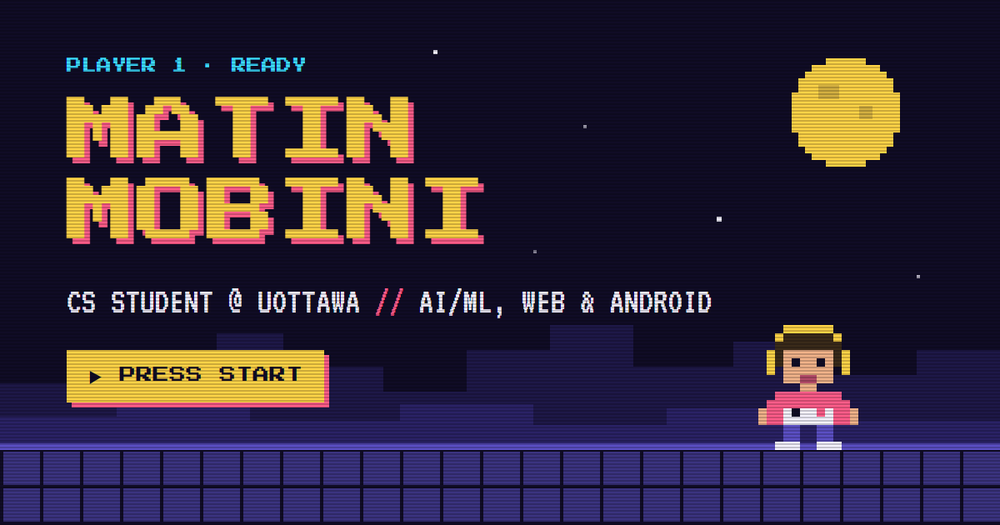

# PIXEL QUEST · Matin Mobini's portfolio



A retro arcade portfolio where **every section is a playable level** and the little runner is
driven by a **real neural network trained with neuroevolution**. Scroll, and the AI runs, jumps and
stomps its way through six themed worlds while the page tells you about me.

**Live site:** https://matinhmobini.github.io/Portfolio/

I'm Matin Mobini, an Honours Computer Science student at the University of Ottawa (AI & ML
concentration) building AI/ML, web and Android apps.

## What's inside

```
Intro       pixel bedroom, spawn, terminal, ./matin_portfolio.exe, boot screen
World 1     Home        night overworld, HUD, world map, typewriter dialog
World 2     About       sky level: photo, bio, skill bars, active quests
World 3     Experience  underground mine: work experience as an arcade score table
World 4     Projects    tech factory: projects as game cartridges
World 5     Neural Net  circuit world: the live brain, ML readouts, Training Lab
World 6     Continue?   boss castle: countdown and contact form
```

- **An AI that really plays.** A small multilayer perceptron (8 senses, 10 and 8 hidden neurons,
  5 actions, 223 weights) steers the runner every frame. The brain diagram lights up with its live
  activations, and new pathways appear the first time it shows a skill.
- **Trained offline, retrainable live.** `npm run train` evolves a population of brains on seeded
  levels from all six worlds with a genetic algorithm (tournament selection, elitism, neuron-level
  crossover, gaussian mutation). The **Training Lab** runs the same algorithm in a Web Worker so
  visitors can watch a population learn from scratch.
- **You can take the controller.** Open the AI brain and press **PLAY IT YOURSELF**, or enter the
  Konami code (↑ ↑ ↓ ↓ ← → ← → B A).
- **Details that make it feel like a game:** chiptune sound effects synthesised with Web Audio, a
  CRT filter, enemies with something to say, coins, lives and a score in the HUD.
- **Works everywhere:** phone layout with a touch D-pad, reduced-motion support, and the whole page
  is rendered at build time so it is readable even without JavaScript.

## Tech

TypeScript, Vite, Canvas 2D, Web Audio, Web Workers and Vitest, with **zero runtime
dependencies**. The game, the neural network and the genetic algorithm are all written from scratch.
GitHub Actions tests, builds and deploys the site to GitHub Pages on every push.

## Run it locally

Needs Node.js 22.6 or newer.

```bash
npm install
npm run dev        # http://localhost:5173/Portfolio/
```

| Command | What it does |
| --- | --- |
| `npm run dev` | Dev server with hot reload |
| `npm test` | Unit tests |
| `npm run build` | Type-check and production build into `dist/` |
| `npm run preview` | Serve `dist/` at http://localhost:4173/Portfolio/ |
| `npm run train` | Retrain the AI and save `src/ai/champion.json` |
| `npm run evaluate` | Test the trained AI on levels it has never seen |

Add `?nointro` to the URL to skip the intro while developing.

## Project layout

| Path | What lives there |
| --- | --- |
| `src/content.ts` | All the text: bio, experience, projects, skills, links |
| `src/game/` | Level generator, physics, sprites, themes, renderer |
| `src/ai/` | Neural network, neuroevolution, brain visual, Training Lab, trained champion |
| `src/intro/` | The bedroom-to-boot intro sequence |
| `src/sections/` | Build-time HTML rendering and page interactions |
| `scripts/` | Offline training and evaluation |
| `tests/` | Unit tests for the network, evolution, physics, levels and content |

More detail in **[GUIDE.md](GUIDE.md)** (setup, editing and deploying) and
**[docs/SPEC.md](docs/SPEC.md)** (design and decisions).

## Contact

- LinkedIn: https://www.linkedin.com/in/matin-mobini-56aa56277/
- GitHub: https://github.com/MatinHMobini
- Email: hmobinimatin@gmail.com

Designed and built by Matin Mobini.
